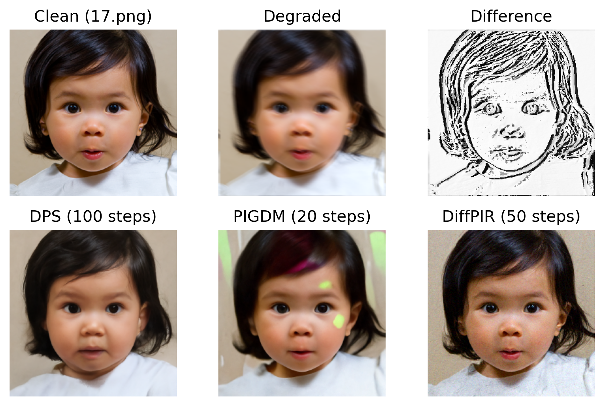

# Guided Diffusion Models

**Authors:** Tom LABIAUSSE - Theïlo TERRISSE

**Date:** Feb/Mar 2024

## 0 - Setup

* Clone the repository:
```bash
git clone git@github.com:t0m1ab/MVA_DELIRES_project.git
```

* Install `delires` as a package in edit mode (see config in `pyproject.toml`): 
```bash
mv MVA_DELIRES_project/
pip install -e .
```

* Perform the data pipeline setup (nn download + kernels/masks creation + degraded datasets creation):
```bash
bash delires/data.sh
``` 

* Launch the benchmark:
```bash
python delires/main.py
``` 

## 1 - Methods

### 1.1 - DPS

TODO

### 1.2 - PiGDM

TODO

### 1.3 - DiffPIR

TODO


## 2 - Demo




## 3 - References

* [1] [Diffusion Posterior Sampling for General Noisy Inverse Problems](https://openreview.net/forum?id=OnD9zGAGT0k) - Chung et al. (ICLR 2023)

* [2] [Pseudoinverse-Guided Diffusion Models for Inverse Problems](https://openreview.net/forum?id=9_gsMA8MRKQ) - Song et al. (ICLR 2023)

* [3] [Denoising Diffusion Models for Plug-and-Play Image Restoration](https://yuanzhi-zhu.github.io/DiffPIR/) - Zhu et al. (CVPR 2023)