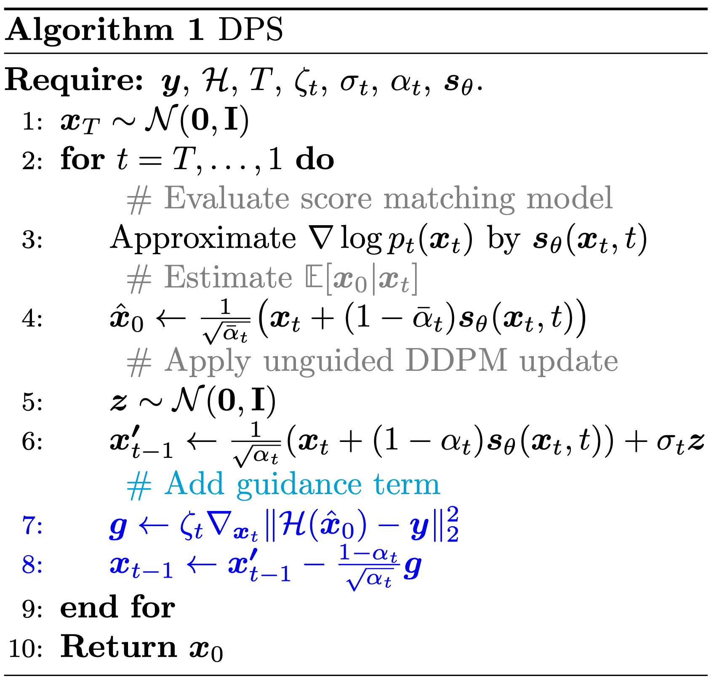

# Guided Diffusion Models

**Authors:** Tom LABIAUSSE - Theïlo TERRISSE

**Date:** Feb/Mar 2024

## 0 - Setup

* Clone the repository:
```bash
git clone git@github.com:t0m1ab/MVA_DELIRES_project.git
```

* Install `delires` as a package in edit mode (see config in `pyproject.toml`): 
```bash
cd MVA_DELIRES_project/
pip install -e .
```

* Install python dependencies:
```bash
pip install -r requirements.txt
```

* Perform the data pipeline setup (nn download + kernels/masks creation + degraded datasets creation):
```bash
cd delires
bash data.sh
``` 

* Launch the benchmark:
```bash
python main.py
``` 

* Visualization of the results using the notebook [visualization.ipynb](./delires/visualization.ipynb)

## 1 - Methods

### 1.1 - DPS [1]



### 1.2 - PiGDM [2]


### 1.3 - DiffPIR []


## 2 - Example of results

### 2.1 - Blur + Noise

 

 

### 2.2 - Mask + Noise

 

 

### 2.3 - Metrics

These metrics were obtained after benchmarking the previous methods on 100 images from the FFHQ dataset. The experimental protocol is detailed in our [project report](https://huggingface.co/t0m1ab/mva-delires-data/blob/main/AA2-Labiausse-Terrisse-rapport.pdf).


## 3 - References

* [1] [Diffusion Posterior Sampling for General Noisy Inverse Problems](https://openreview.net/forum?id=OnD9zGAGT0k) - Chung et al. (ICLR 2023)

* [2] [Pseudoinverse-Guided Diffusion Models for Inverse Problems](https://openreview.net/forum?id=9_gsMA8MRKQ) - Song et al. (ICLR 2023)

* [3] [Denoising Diffusion Models for Plug-and-Play Image Restoration](https://yuanzhi-zhu.github.io/DiffPIR/) - Zhu et al. (CVPR 2023)

As part of the MVA DELIRES course at ENS Paris-Saclay, this project builds on an implementation of DPS and PiGDM from [Andrés ALMANSA](https://perso.telecom-paristech.fr/almansa/HomePage/) and DiffPIR from the original authors of [1].
